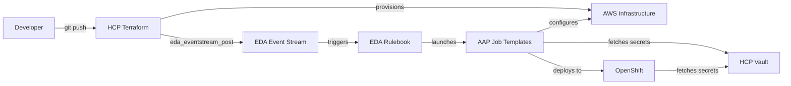

# Red Hat + HashiCorp Demo - Terraform Actions Integration

A comprehensive demonstration of unified hybrid cloud automation using HCP Terraform, HCP Vault, Ansible Automation Platform, and OpenShift.

## 🎯 Overview

This demo showcases the complete workflow:

**Terraform → Vault → Ansible → OpenShift**

- **HCP Terraform** provisions AWS infrastructure
- **Ansible AAP Provider** posts events to EDA using `eda_eventstream_post` action
- **EDA Rulebook** triggers Ansible job templates
- **HCP Vault** provides dynamic credentials and secrets
- **Ansible** configures infrastructure and deploys applications
- **OpenShift** runs the containerized application

## 📋 Prerequisites

- HCP account (Terraform + Vault)
- AWS account with admin access
- Ansible Automation Platform 2.4+
- OpenShift Local (CRC) or OpenShift cluster
- GitHub account

## 🚀 Quick Start

### 1. Clone Repository

```bash
git clone https://github.com/StevenJohnWeaver/TF-AAP-Actions-Bob-Demo.git
cd TF-AAP-Actions-Bob-Demo
```

### 2. Follow Setup Guides

Complete the setup guides in order:

1. **[HCP Terraform Setup](docs/01-hcp-terraform-setup.md)** - Create workspace and configure variables
2. **[HCP Vault Setup](docs/02-hcp-vault-setup.md)** - Create cluster and configure secrets
3. **[AAP Setup](docs/03-aap-setup.md)** - Configure EDA and job templates

### 3. Run the Demo

Once configured, simply run:

```bash
# In HCP Terraform workspace
terraform apply
```

This triggers the entire workflow automatically!

## 📁 Repository Structure

```
.
├── docs/                          # Setup guides
│   ├── 01-hcp-terraform-setup.md
│   ├── 02-hcp-vault-setup.md
│   └── 03-aap-setup.md
├── terraform/                     # Infrastructure as Code
│   ├── main.tf                    # Main configuration with AAP provider
│   ├── variables.tf               # Variable definitions
│   ├── outputs.tf                 # Output values
│   └── modules/                   # Reusable modules
│       ├── vpc/                   # VPC and networking
│       ├── security/              # Security groups
│       └── compute/               # EC2 instances
├── vault/                         # HCP Vault configuration
│   ├── scripts/
│   │   ├── setup-hcp-vault.sh    # Automated setup
│   │   └── seed-secrets.sh       # Populate secrets
│   └── policies/                  # Access policies
├── extensions/eda/                # Event-Driven Ansible
│   └── rulebooks/
│       └── terraform-infrastructure-trigger.yml
├── playbooks/                     # Ansible playbooks
│   ├── configure-infrastructure.yml
│   └── deploy-to-openshift.yml
└── demo-architecture-plan.md      # Complete architecture documentation
```

## 🔑 Key Features

### Native Integration

- Uses **Ansible AAP Terraform Provider** for native integration
- **`eda_eventstream_post` action** posts events directly to EDA
- No webhooks or external services needed

### Security by Design

- **HCP Vault** manages all secrets
- **Dynamic AWS credentials** generated on-demand
- **AppRole authentication** for Ansible
- **Policy-based access control**

### Complete Automation

- **Terraform** provisions infrastructure
- **EDA** automatically triggers configuration
- **Ansible** configures instances and deploys to OpenShift
- **End-to-end traceability** with Terraform run ID

## 🎬 Demo Flow



## 📚 Documentation

### Setup Guides

- [01 - HCP Terraform Setup](docs/01-hcp-terraform-setup.md) - Workspace and variables
- [02 - HCP Vault Setup](docs/02-hcp-vault-setup.md) - Cluster and secrets
- [03 - AAP Setup](docs/03-aap-setup.md) - EDA and job templates

### Architecture

- [Architecture Plan](demo-architecture-plan.md) - Complete technical design

### Reference

- [Terraform Variables Example](terraform/terraform.tfvars.example)
- [Vault Policies](vault/policies/)

## 🔧 Configuration

### HCP Terraform Variables

Required variables (set in HCP Terraform workspace):

```hcl
# HCP Vault
hcp_vault_address   = "https://your-cluster.vault.hashicorp.cloud:8200"
hcp_vault_namespace = "admin"
hcp_vault_token     = "hvs.CAESIJ..." # Sensitive

# AAP
aap_host     = "https://your-aap-controller.example.com"
aap_username = "admin"                 # Sensitive
aap_password = "your-password"         # Sensitive

# AWS
aws_region    = "us-east-1"
instance_count = 2
ssh_key_name  = "your-key-name"

# See terraform.tfvars.example for complete list
```

### HCP Vault Secrets

Secrets are organized in these paths:

```
secret/
├── applications/demo-app    # Application secrets
├── ansible/config           # Ansible configuration
├── openshift/credentials    # OpenShift access
├── terraform/config         # Terraform settings
└── eda/webhook-tokens       # EDA authentication
```

## 🧪 Testing

### Verify HCP Terraform

```bash
# In HCP Terraform workspace
terraform plan
```

### Verify HCP Vault

```bash
export VAULT_ADDR="https://your-cluster.vault.hashicorp.cloud:8200"
export VAULT_TOKEN="your-token"
vault status
vault kv list secret/
```

### Verify AAP

```bash
# Check EDA activation is running
# Check job templates exist
# Test event stream with manual event
```

## 🐛 Troubleshooting

### Terraform Plan Fails

- Verify HCP Vault variables are set correctly
- Check Vault token is valid: `vault token lookup`
- Ensure AWS credentials are configured in Vault

### EDA Not Triggering

- Verify EDA activation is running
- Check event stream name matches: `terraform-infrastructure-events`
- Review EDA activation logs

### Ansible Job Fails

- Check HCP Vault credentials in AAP
- Verify AppRole credentials are correct
- Review job output logs in AAP

## 📞 Support

For issues:

1. Check the troubleshooting section in each setup guide
2. Review the [Architecture Plan](demo-architecture-plan.md)
3. Check logs:
   - HCP Terraform: Workspace runs
   - HCP Vault: Audit logs
   - AAP: Job output
   - OpenShift: Pod logs

## 🤝 Contributing

This is a demo repository. Feel free to:

- Fork and customize for your needs
- Submit issues for bugs or improvements
- Share feedback on the architecture

## 📄 License

This demo is provided as-is for educational and demonstration purposes.

## 🔗 Resources

### HashiCorp

- [HCP Terraform](https://developer.hashicorp.com/terraform/cloud-docs)
- [HCP Vault](https://developer.hashicorp.com/hcp/docs/vault)
- [Terraform AAP Provider](https://registry.terraform.io/providers/ansible/aap/latest)

### Red Hat

- [Ansible Automation Platform](https://www.redhat.com/en/technologies/management/ansible)
- [Event-Driven Ansible](https://www.ansible.com/products/event-driven-ansible)
- [OpenShift](https://www.redhat.com/en/technologies/cloud-computing/openshift)

### Demo Components

- [Terraform Actions](https://registry.terraform.io/providers/ansible/aap/latest/docs/actions/eda_eventstream_post)
- [Vault AWS Secrets Engine](https://developer.hashicorp.com/vault/docs/secrets/aws)
- [Ansible Vault Integration](https://docs.ansible.com/ansible/latest/collections/community/hashi_vault/)

---

**Version**: 1.0  
**Last Updated**: 2024-12-09  
**Maintained By**: Steve Weaver