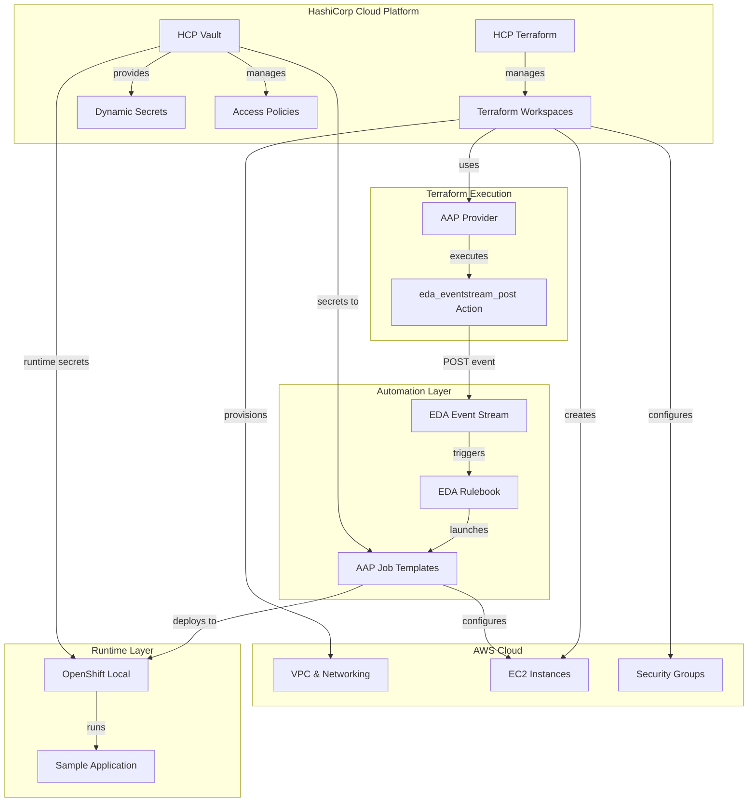
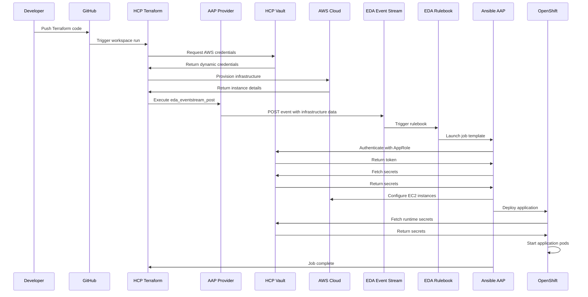

# Red Hat + HashiCorp Hybrid Cloud Automation Demo
## Architecture & Implementation Plan (HCP Edition with AAP Terraform Provider Actions)

**Demo Type**: Lightweight Proof-of-Concept with Enterprise Tools  
**Target Environment**: AWS + Local OpenShift  
**HashiCorp Platform**: HCP Terraform + HCP Vault  
**Integration Method**: Ansible AAP Terraform Provider → `eda_eventstream_post` Action  
**Narrative**: Unified automation workflow demonstrating Terraform → Vault → Ansible → OpenShift

---

## Executive Summary

This demo showcases how Red Hat and HashiCorp enterprise solutions provide a unified automation foundation across the hybrid application lifecycle:
- **HCP Terraform**: Cloud-based infrastructure provisioning
- **Ansible AAP Terraform Provider**: Native integration using `eda_eventstream_post` action
- **HCP Vault**: Enterprise secrets management with dynamic credentials
- **Ansible Automation Platform**: Configuration management triggered by Terraform actions
- **OpenShift**: Consistent container runtime

---

## Architecture Overview



---

## Ansible AAP Terraform Provider Integration

### What is the AAP Terraform Provider?

The **Ansible AAP Terraform Provider** (`ansible/aap`) provides native Terraform resources and actions for managing Ansible Automation Platform. The `eda_eventstream_post` action allows Terraform to directly post events to EDA event streams.

**Key Features**:
- ✅ **Native Terraform Action**: No webhooks or external services needed
- ✅ **Direct EDA Integration**: Posts directly to EDA event streams
- ✅ **Type-Safe**: Structured event payload with validation
- ✅ **Synchronous**: Terraform waits for event posting to complete
- ✅ **Secure**: Uses AAP authentication tokens
- ✅ **Simple**: No HMAC signatures or callback mechanisms needed

### Provider Documentation

**Registry**: https://registry.terraform.io/providers/ansible/aap/latest  
**Action**: `eda_eventstream_post`  
**Documentation**: https://registry.terraform.io/providers/ansible/aap/latest/docs/actions/eda_eventstream_post

---

## Component Architecture

### 1. HCP Terraform with AAP Provider

#### 1.1 Provider Configuration

**Terraform Configuration with AAP Provider**:
```hcl
# terraform/main.tf
terraform {
  cloud {
    organization = "redhat-hashicorp-demo"
    workspaces {
      name = "aws-infrastructure"
    }
  }
  
  required_providers {
    aws = {
      source  = "hashicorp/aws"
      version = "~> 5.0"
    }
    vault = {
      source  = "hashicorp/vault"
      version = "~> 3.0"
    }
    aap = {
      source  = "ansible/aap"
      version = "~> 1.0"
    }
  }
}

# Configure AAP Provider
provider "aap" {
  host     = var.aap_host  # e.g., "https://aap-controller.example.com"
  username = var.aap_username
  password = var.aap_password
  # Or use token authentication:
  # token = var.aap_token
}

# Configure Vault Provider for HCP Vault
provider "vault" {
  address   = var.hcp_vault_address
  namespace = var.hcp_vault_namespace
  token     = var.hcp_vault_token
}

# Fetch dynamic AWS credentials from HCP Vault
data "vault_aws_access_credentials" "creds" {
  backend = "aws"
  role    = "terraform-provisioner"
}

# Configure AWS Provider with Vault credentials
provider "aws" {
  region     = var.aws_region
  access_key = data.vault_aws_access_credentials.creds.access_key
  secret_key = data.vault_aws_access_credentials.creds.secret_key
}
```

#### 1.2 Infrastructure Provisioning

**VPC, Compute, and Security Modules**:
```hcl
# terraform/main.tf (continued)

# VPC Module
module "vpc" {
  source = "./modules/vpc"
  
  cidr_block      = var.vpc_cidr
  environment     = var.environment
  project_name    = var.project_name
  public_subnets  = var.public_subnet_cidrs
  private_subnets = var.private_subnet_cidrs
}

# Security Module
module "security" {
  source = "./modules/security"
  
  vpc_id       = module.vpc.vpc_id
  environment  = var.environment
  project_name = var.project_name
}

# Compute Module
module "compute" {
  source = "./modules/compute"
  
  vpc_id            = module.vpc.vpc_id
  subnet_ids        = module.vpc.private_subnet_ids
  instance_count    = var.instance_count
  instance_type     = var.instance_type
  key_name          = var.ssh_key_name
  security_group_id = module.security.app_sg_id
  
  tags = {
    Environment = var.environment
    ManagedBy   = "terraform"
    Demo        = "redhat-hashicorp"
    Role        = "app-server"
  }
}
```

#### 1.3 EDA Event Stream Post Action

**Using `eda_eventstream_post` to Trigger AAP**:
```hcl
# terraform/main.tf (continued)

# Post event to EDA after infrastructure is provisioned
resource "aap_eda_eventstream_post" "infrastructure_ready" {
  # This action executes after all infrastructure is created
  depends_on = [
    module.vpc,
    module.compute,
    module.security
  ]
  
  # EDA event stream name (must exist in AAP)
  event_stream_name = "terraform-infrastructure-events"
  
  # Event payload - this is what EDA rulebook will receive
  event = jsonencode({
    source = "terraform"
    event_type = "infrastructure_provisioned"
    timestamp = timestamp()
    
    # Terraform context
    terraform = {
      workspace    = "aws-infrastructure"
      organization = "redhat-hashicorp-demo"
      run_id       = var.terraform_run_id
    }
    
    # Infrastructure details
    infrastructure = {
      vpc = {
        id   = module.vpc.vpc_id
        cidr = module.vpc.vpc_cidr
      }
      
      instances = [
        for idx, id in module.compute.instance_ids : {
          id         = id
          name       = "app-server-${idx + 1}"
          private_ip = module.compute.private_ips[idx]
          public_ip  = module.compute.public_ips[idx]
          role       = "app-server"
        }
      ]
      
      security_groups = module.security.security_group_ids
      
      region      = var.aws_region
      environment = var.environment
    }
    
    # Ansible inventory structure
    ansible_inventory = {
      all = {
        hosts = {
          for idx, id in module.compute.instance_ids :
          "app-server-${idx + 1}" => {
            ansible_host = module.compute.private_ips[idx]
            instance_id  = id
            public_ip    = module.compute.public_ips[idx]
            ansible_user = "ec2-user"
          }
        }
        vars = {
          ansible_ssh_private_key_file = "~/.ssh/demo-key.pem"
          aws_region                   = var.aws_region
          vpc_id                       = module.vpc.vpc_id
        }
      }
      children = {
        app_servers = {
          hosts = [
            for idx in range(length(module.compute.instance_ids)) :
            "app-server-${idx + 1}"
          ]
        }
      }
    }
    
    # Deployment configuration
    deployment = {
      openshift_namespace = "demo-app"
      application_name    = "demo-app"
      replicas           = 2
    }
  })
}

# Outputs for reference
output "infrastructure_details" {
  value = {
    vpc_id       = module.vpc.vpc_id
    instance_ids = module.compute.instance_ids
    private_ips  = module.compute.private_ips
    public_ips   = module.compute.public_ips
  }
  description = "Infrastructure details"
}

output "eda_event_posted" {
  value = {
    event_stream = aap_eda_eventstream_post.infrastructure_ready.event_stream_name
    timestamp    = timestamp()
  }
  description = "EDA event posting confirmation"
}
```

#### 1.4 Variables Configuration

**Terraform Variables**:
```hcl
# terraform/variables.tf

# HCP Vault Configuration
variable "hcp_vault_address" {
  description = "HCP Vault cluster address"
  type        = string
}

variable "hcp_vault_namespace" {
  description = "HCP Vault namespace"
  type        = string
  default     = "admin"
}

variable "hcp_vault_token" {
  description = "HCP Vault authentication token"
  type        = string
  sensitive   = true
}

# AAP Configuration
variable "aap_host" {
  description = "Ansible Automation Platform controller URL"
  type        = string
}

variable "aap_username" {
  description = "AAP username"
  type        = string
  sensitive   = true
}

variable "aap_password" {
  description = "AAP password"
  type        = string
  sensitive   = true
}

# AWS Configuration
variable "aws_region" {
  description = "AWS region"
  type        = string
  default     = "us-east-1"
}

variable "vpc_cidr" {
  description = "VPC CIDR block"
  type        = string
  default     = "10.0.0.0/16"
}

variable "public_subnet_cidrs" {
  description = "Public subnet CIDR blocks"
  type        = list(string)
  default     = ["10.0.1.0/24", "10.0.2.0/24"]
}

variable "private_subnet_cidrs" {
  description = "Private subnet CIDR blocks"
  type        = list(string)
  default     = ["10.0.10.0/24", "10.0.11.0/24"]
}

variable "instance_count" {
  description = "Number of EC2 instances"
  type        = number
  default     = 2
}

variable "instance_type" {
  description = "EC2 instance type"
  type        = string
  default     = "t3.medium"
}

variable "ssh_key_name" {
  description = "SSH key pair name"
  type        = string
}

variable "environment" {
  description = "Environment name"
  type        = string
  default     = "demo"
}

variable "project_name" {
  description = "Project name"
  type        = string
  default     = "redhat-hashicorp"
}

variable "terraform_run_id" {
  description = "Terraform Cloud run ID"
  type        = string
  default     = "local-run"
}
```

---

### 2. EDA Event Stream and Rulebook

#### 2.1 EDA Event Stream Configuration

**Create Event Stream in AAP**:
```yaml
# extensions/eda/event-streams/terraform-infrastructure-events.yml
---
name: terraform-infrastructure-events
description: "Event stream for Terraform infrastructure provisioning events"
organization: Default
event_stream_type: generic
enabled: true
```

**Or create via AAP API**:
```bash
# Create event stream via API
curl -X POST https://aap-controller.example.com/api/v2/event_streams/ \
  -H "Authorization: Bearer $AAP_TOKEN" \
  -H "Content-Type: application/json" \
  -d '{
    "name": "terraform-infrastructure-events",
    "description": "Event stream for Terraform infrastructure provisioning",
    "organization": 1,
    "event_stream_type": "generic",
    "enabled": true
  }'
```

#### 2.2 EDA Rulebook

**Rulebook to Process Terraform Events**:
```yaml
# extensions/eda/rulebooks/terraform-infrastructure-trigger.yml
---
- name: Terraform Infrastructure Event Handler
  hosts: all
  
  sources:
    - name: Listen to Terraform event stream
      ansible.eda.generic:
        event_stream_name: terraform-infrastructure-events
        
  rules:
    - name: Handle Infrastructure Provisioned Event
      condition: >
        event.source == "terraform" and
        event.event_type == "infrastructure_provisioned"
      
      action:
        run_job_template:
          name: "Configure AWS Infrastructure"
          organization: "Default"
          inventory: "Dynamic AWS Inventory"
          
          extra_vars:
            # Terraform context
            terraform_workspace: "{{ event.terraform.workspace }}"
            terraform_organization: "{{ event.terraform.organization }}"
            terraform_run_id: "{{ event.terraform.run_id }}"
            
            # Infrastructure details
            vpc_id: "{{ event.infrastructure.vpc.id }}"
            vpc_cidr: "{{ event.infrastructure.vpc.cidr }}"
            aws_region: "{{ event.infrastructure.region }}"
            environment: "{{ event.infrastructure.environment }}"
            
            # Instance details
            instances: "{{ event.infrastructure.instances }}"
            security_groups: "{{ event.infrastructure.security_groups }}"
            
            # Ansible inventory
            dynamic_inventory: "{{ event.ansible_inventory }}"
            
            # Deployment config
            openshift_namespace: "{{ event.deployment.openshift_namespace }}"
            application_name: "{{ event.deployment.application_name }}"
            replicas: "{{ event.deployment.replicas }}"
    
    - name: Log Terraform Events
      condition: event.source == "terraform"
      action:
        debug:
          msg: "Received Terraform event: {{ event.event_type }} from workspace {{ event.terraform.workspace }}"
```

#### 2.3 EDA Activation Configuration

**Activate the Rulebook**:
```yaml
# extensions/eda/activations/terraform-handler-activation.yml
---
name: terraform-infrastructure-handler
description: "Process Terraform infrastructure provisioning events"
rulebook: terraform-infrastructure-trigger.yml
decision_environment: "Default Decision Environment"
project: "AAP Demo Project"
enabled: true
restart_policy: "on-failure"
event_streams:
  - terraform-infrastructure-events
```

---

### 3. Ansible Playbooks

#### 3.1 Main Configuration Playbook

**Configure Infrastructure from Terraform Event**:
```yaml
# playbooks/configure-infrastructure.yml
---
- name: Display Terraform Event Context
  hosts: localhost
  connection: local
  gather_facts: no
  
  tasks:
    - name: Show Terraform context
      debug:
        msg:
          - "Terraform Workspace: {{ terraform_workspace }}"
          - "Terraform Run ID: {{ terraform_run_id }}"
          - "VPC ID: {{ vpc_id }}"
          - "Region: {{ aws_region }}"
          - "Instance Count: {{ instances | length }}"
    
    - name: Authenticate to HCP Vault
      uri:
        url: "{{ lookup('env', 'VAULT_ADDR') }}/v1/auth/approle/login"
        method: POST
        body_format: json
        headers:
          X-Vault-Namespace: "{{ lookup('env', 'VAULT_NAMESPACE') }}"
        body:
          role_id: "{{ lookup('env', 'VAULT_ROLE_ID') }}"
          secret_id: "{{ lookup('env', 'VAULT_SECRET_ID') }}"
      register: vault_login
    
    - name: Set Vault token
      set_fact:
        vault_token: "{{ vault_login.json.auth.client_token }}"
    
    - name: Build in-memory inventory from Terraform event
      add_host:
        name: "{{ item.name }}"
        groups: 
          - app_servers
          - aws_ec2
        ansible_host: "{{ item.private_ip }}"
        instance_id: "{{ item.id }}"
        public_ip: "{{ item.public_ip }}"
        ansible_user: "ec2-user"
        ansible_ssh_private_key_file: "~/.ssh/demo-key.pem"
      loop: "{{ instances }}"
      loop_control:
        label: "{{ item.name }}"

- name: Configure EC2 Instances
  hosts: app_servers
  gather_facts: yes
  become: yes
  
  vars:
    vault_token: "{{ hostvars['localhost']['vault_token'] }}"
    vault_addr: "{{ lookup('env', 'VAULT_ADDR') }}"
    vault_namespace: "{{ lookup('env', 'VAULT_NAMESPACE') }}"
  
  tasks:
    - name: Fetch application secrets from HCP Vault
      uri:
        url: "{{ vault_addr }}/v1/secret/data/applications/demo-app"
        method: GET
        headers:
          X-Vault-Token: "{{ vault_token }}"
          X-Vault-Namespace: "{{ vault_namespace }}"
      register: app_secrets
      delegate_to: localhost
      run_once: true
    
    - name: Set application secrets
      set_fact:
        database_url: "{{ app_secrets.json.data.data.database_url }}"
        api_key: "{{ app_secrets.json.data.data.api_key }}"
    
    - name: Update system packages
      yum:
        name: '*'
        state: latest
      register: yum_update
    
    - name: Install required packages
      yum:
        name:
          - docker
          - python3
          - python3-pip
          - git
          - vim
          - htop
        state: present
    
    - name: Start and enable Docker
      systemd:
        name: docker
        state: started
        enabled: yes
    
    - name: Create application directory
      file:
        path: /opt/demo-app
        state: directory
        mode: '0755'
    
    - name: Deploy application configuration
      template:
        src: templates/app-config.j2
        dest: /opt/demo-app/config.yml
        mode: '0600'
      vars:
        db_url: "{{ database_url }}"
        app_api_key: "{{ api_key }}"
        terraform_run_id: "{{ hostvars['localhost']['terraform_run_id'] }}"
        vpc_id: "{{ hostvars['localhost']['vpc_id'] }}"
    
    - name: Create systemd service for app
      template:
        src: templates/demo-app.service.j2
        dest: /etc/systemd/system/demo-app.service
        mode: '0644'
      notify: Reload systemd
    
    - name: Validate configuration
      command: /usr/local/bin/validate-config.sh
      register: validation
      changed_when: false
      failed_when: validation.rc != 0
  
  handlers:
    - name: Reload systemd
      systemd:
        daemon_reload: yes

- name: Trigger OpenShift Deployment
  hosts: localhost
  connection: local
  gather_facts: no
  
  tasks:
    - name: Launch OpenShift deployment job
      awx.awx.job_launch:
        job_template: "Deploy to OpenShift"
        extra_vars:
          terraform_run_id: "{{ terraform_run_id }}"
          vpc_id: "{{ vpc_id }}"
          instances: "{{ instances }}"
          openshift_namespace: "{{ openshift_namespace }}"
          application_name: "{{ application_name }}"
          replicas: "{{ replicas }}"
      register: openshift_job
    
    - name: Display OpenShift job info
      debug:
        msg: "OpenShift deployment job launched: {{ openshift_job.id }}"
```

#### 3.2 OpenShift Deployment Playbook

```yaml
# playbooks/deploy-to-openshift.yml
---
- name: Deploy Application to OpenShift
  hosts: localhost
  connection: local
  
  vars:
    vault_addr: "{{ lookup('env', 'VAULT_ADDR') }}"
    vault_namespace: "{{ lookup('env', 'VAULT_NAMESPACE') }}"
    
  tasks:
    - name: Display deployment context
      debug:
        msg:
          - "Deploying from Terraform Run: {{ terraform_run_id }}"
          - "VPC: {{ vpc_id }}"
          - "Backend Instances: {{ instances | length }}"
          - "Namespace: {{ openshift_namespace }}"
    
    - name: Authenticate to HCP Vault
      uri:
        url: "{{ vault_addr }}/v1/auth/approle/login"
        method: POST
        body_format: json
        headers:
          X-Vault-Namespace: "{{ vault_namespace }}"
        body:
          role_id: "{{ lookup('env', 'VAULT_ROLE_ID') }}"
          secret_id: "{{ lookup('env', 'VAULT_SECRET_ID') }}"
      register: vault_login
    
    - name: Fetch OpenShift credentials from HCP Vault
      uri:
        url: "{{ vault_addr }}/v1/secret/data/openshift/credentials"
        method: GET
        headers:
          X-Vault-Token: "{{ vault_login.json.auth.client_token }}"
          X-Vault-Namespace: "{{ vault_namespace }}"
      register: ocp_creds
    
    - name: Login to OpenShift
      kubernetes.core.k8s_auth:
        host: "https://api.crc.testing:6443"
        username: "{{ ocp_creds.json.data.data.admin_user }}"
        password: "{{ ocp_creds.json.data.data.admin_password }}"
        validate_certs: no
      register: k8s_auth
    
    - name: Create namespace
      kubernetes.core.k8s:
        api_key: "{{ k8s_auth.k8s_auth.api_key }}"
        state: present
        definition:
          apiVersion: v1
          kind: Namespace
          metadata:
            name: "{{ openshift_namespace }}"
            labels:
              terraform-run-id: "{{ terraform_run_id }}"
              managed-by: "terraform-aap"
              vpc-id: "{{ vpc_id }}"
    
    - name: Fetch application secrets from HCP Vault
      uri:
        url: "{{ vault_addr }}/v1/secret/data/applications/demo-app"
        method: GET
        headers:
          X-Vault-Token: "{{ vault_login.json.auth.client_token }}"
          X-Vault-Namespace: "{{ vault_namespace }}"
      register: app_secrets
    
    - name: Create OpenShift secret
      kubernetes.core.k8s:
        api_key: "{{ k8s_auth.k8s_auth.api_key }}"
        state: present
        definition:
          apiVersion: v1
          kind: Secret
          metadata:
            name: app-secrets
            namespace: "{{ openshift_namespace }}"
            labels:
              terraform-run-id: "{{ terraform_run_id }}"
          type: Opaque
          stringData:
            database-url: "{{ app_secrets.json.data.data.database_url }}"
            api-key: "{{ app_secrets.json.data.data.api_key }}"
            backend-ips: "{{ instances | map(attribute='private_ip') | join(',') }}"
    
    - name: Create ConfigMap with infrastructure details
      kubernetes.core.k8s:
        api_key: "{{ k8s_auth.k8s_auth.api_key }}"
        state: present
        definition:
          apiVersion: v1
          kind: ConfigMap
          metadata:
            name: infrastructure-config
            namespace: "{{ openshift_namespace }}"
            labels:
              terraform-run-id: "{{ terraform_run_id }}"
          data:
            vpc_id: "{{ vpc_id }}"
            aws_region: "{{ instances[0].region | default('us-east-1') }}"
            terraform_run_id: "{{ terraform_run_id }}"
            backend_instance_ids: "{{ instances | map(attribute='id') | join(',') }}"
            backend_instance_ips: "{{ instances | map(attribute='private_ip') | join(',') }}"
    
    - name: Deploy application
      kubernetes.core.k8s:
        api_key: "{{ k8s_auth.k8s_auth.api_key }}"
        state: present
        namespace: "{{ openshift_namespace }}"
        definition:
          apiVersion: apps/v1
          kind: Deployment
          metadata:
            name: "{{ application_name }}"
            labels:
              app: "{{ application_name }}"
              terraform-run-id: "{{ terraform_run_id }}"
          spec:
            replicas: "{{ replicas }}"
            selector:
              matchLabels:
                app: "{{ application_name }}"
            template:
              metadata:
                labels:
                  app: "{{ application_name }}"
                  terraform-run-id: "{{ terraform_run_id }}"
              spec:
                containers:
                - name: app
                  image: quay.io/redhat-demo/sample-app:latest
                  ports:
                  - containerPort: 8080
                    name: http
                  env:
                  - name: DATABASE_URL
                    valueFrom:
                      secretKeyRef:
                        name: app-secrets
                        key: database-url
                  - name: API_KEY
                    valueFrom:
                      secretKeyRef:
                        name: app-secrets
                        key: api-key
                  - name: BACKEND_IPS
                    valueFrom:
                      secretKeyRef:
                        name: app-secrets
                        key: backend-ips
                  - name: VPC_ID
                    valueFrom:
                      configMapKeyRef:
                        name: infrastructure-config
                        key: vpc_id
                  - name: TERRAFORM_RUN_ID
                    valueFrom:
                      configMapKeyRef:
                        name: infrastructure-config
                        key: terraform_run_id
    
    - name: Create Service
      kubernetes.core.k8s:
        api_key: "{{ k8s_auth.k8s_auth.api_key }}"
        state: present
        namespace: "{{ openshift_namespace }}"
        definition:
          apiVersion: v1
          kind: Service
          metadata:
            name: "{{ application_name }}"
          spec:
            selector:
              app: "{{ application_name }}"
            ports:
            - name: http
              port: 8080
              targetPort: 8080
    
    - name: Create Route
      kubernetes.core.k8s:
        api_key: "{{ k8s_auth.k8s_auth.api_key }}"
        state: present
        namespace: "{{ openshift_namespace }}"
        definition:
          apiVersion: route.openshift.io/v1
          kind: Route
          metadata:
            name: "{{ application_name }}"
          spec:
            to:
              kind: Service
              name: "{{ application_name }}"
            port:
              targetPort: http
            tls:
              termination: edge
              insecureEdgeTerminationPolicy: Redirect
    
    - name: Wait for deployment
      kubernetes.core.k8s_info:
        api_key: "{{ k8s_auth.k8s_auth.api_key }}"
        kind: Deployment
        name: "{{ application_name }}"
        namespace: "{{ openshift_namespace }}"
      register: deployment
      until: deployment.resources[0].status.readyReplicas == replicas | int
      retries: 30
      delay: 10
    
    - name: Get application route
      kubernetes.core.k8s_info:
        api_key: "{{ k8s_auth.k8s_auth.api_key }}"
        kind: Route
        name: "{{ application_name }}"
        namespace: "{{ openshift_namespace }}"
      register: route
    
    - name: Display deployment success
      debug:
        msg:
          - "✅ Application deployed successfully!"
          - "Route: https://{{ route.resources[0].spec.host }}"
          - "Terraform Run ID: {{ terraform_run_id }}"
          - "VPC ID: {{ vpc_id }}"
          - "Backend Instances: {{ instances | length }}"
```

---

### 4. HCP Vault Configuration

**Same as previous versions - see vault/ directory structure**

---

## Workflow Integration

### Complete Flow with AAP Provider



---

## Demo Execution Flow

### Phase 1: Setup

**1. Setup HCP Terraform**:
```bash
# Configure workspace variables in HCP Terraform UI
# Required variables:
# - hcp_vault_address
# - hcp_vault_namespace
# - hcp_vault_token
# - aap_host
# - aap_username (or aap_token)
# - aap_password
# - aws_region
# - ssh_key_name
```

**2. Setup AAP Event Stream**:
```bash
# Create event stream via AAP UI or API
curl -X POST https://aap-controller.example.com/api/v2/event_streams/ \
  -H "Authorization: Bearer $AAP_TOKEN" \
  -H "Content-Type: application/json" \
  -d '{
    "name": "terraform-infrastructure-events",
    "description": "Terraform infrastructure events",
    "organization": 1,
    "event_stream_type": "generic",
    "enabled": true
  }'
```

**3. Activate EDA Rulebook**:
```bash
# Create and activate rulebook in AAP EDA Controller
awx-eda activations create \
  --name "terraform-infrastructure-handler" \
  --rulebook "terraform-infrastructure-trigger.yml" \
  --event-streams "terraform-infrastructure-events" \
  --enabled true
```

**4. Configure HCP Vault**:
```bash
cd vault/scripts
./setup-hcp-vault.sh
./seed-secrets.sh
```

### Phase 2: Demo Execution

**Run Terraform**:
```bash
cd terraform
terraform init
terraform plan
terraform apply
```

**What Happens**:
1. HCP Terraform provisions AWS infrastructure
2. AAP provider executes `eda_eventstream_post` action
3. Event posted to EDA event stream
4. EDA rulebook triggers AAP job template
5. AAP configures EC2 instances
6. AAP deploys to OpenShift
7. Application is live!

### Phase 3: Validation

```bash
# Check Terraform outputs
terraform output

# Verify EDA event stream
curl -X GET https://aap-controller.example.com/api/v2/event_streams/terraform-infrastructure-events/events/ \
  -H "Authorization: Bearer $AAP_TOKEN"

# Check AAP job status
awx jobs list --filter "extra_vars__terraform_run_id=<run-id>"

# Verify OpenShift deployment
oc get pods -n demo-app -l terraform-run-id=<run-id>
oc get route demo-app -n demo-app
```

---

## File Structure

```
TF-AAP-Actions-Bob-Demo/
├── terraform/
│   ├── main.tf                          # With AAP provider & eda_eventstream_post
│   ├── variables.tf
│   ├── outputs.tf
│   ├── vault.tf
│   └── modules/
│       ├── vpc/
│       ├── compute/
│       └── security/
├── vault/
│   ├── scripts/
│   │   ├── setup-hcp-vault.sh
│   │   └── seed-secrets.sh
│   └── policies/
│       ├── terraform-policy.hcl
│       ├── ansible-policy.hcl
│       └── openshift-policy.hcl
├── extensions/
│   └── eda/
│       ├── event-streams/
│       │   └── terraform-infrastructure-events.yml
│       ├── rulebooks/
│       │   └── terraform-infrastructure-trigger.yml
│       └── activations/
│           └── terraform-handler-activation.yml
├── playbooks/
│   ├── configure-infrastructure.yml
│   ├── deploy-to-openshift.yml
│   ├── templates/
│   │   ├── app-config.j2
│   │   └── demo-app.service.j2
│   └── roles/
│       ├── os-hardening/
│       └── runtime-install/
├── openshift/
│   └── crc-setup.sh
├── docs/
│   ├── aap-provider-setup.md
│   ├── demo-script.md
│   └── troubleshooting.md
└── scripts/
    ├── demo-setup.sh
    ├── demo-run.sh
    └── demo-cleanup.sh
```

---

## Key Benefits

### 1. **Native Integration**
- AAP provider is official Terraform provider
- No webhooks or external services
- Type-safe event payloads

### 2. **Simplicity**
- Single Terraform action posts event
- No HMAC signatures needed
- No callback mechanisms required

### 3. **Reliability**
- Synchronous execution
- Built-in error handling
- Terraform waits for event posting

### 4. **Rich Context**
- Complete infrastructure details in event
- Structured Ansible inventory
- Deployment configuration included

### 5. **Traceability**
- Terraform run ID tracked throughout
- Labels on all resources
- Complete audit trail

---

## Success Criteria

✅ **AAP Provider Integration**: `eda_eventstream_post` successfully posts events  
✅ **EDA Event Stream**: Events received and processed by rulebook  
✅ **HCP Vault**: Dynamic credentials and secrets throughout workflow  
✅ **AAP Configuration**: Instances configured using Terraform event data  
✅ **OpenShift Deployment**: Application deployed with infrastructure metadata  
✅ **End-to-End Traceability**: Terraform run ID tracked through entire workflow  

---

## Next Steps

1. ✅ Review and approve AAP provider architecture
2. Create HCP Terraform workspace
3. Configure AAP event stream
4. Provision HCP Vault cluster
5. Implement Terraform with AAP provider
6. Configure HCP Vault secrets engines
7. Create EDA rulebook for event stream
8. Build Ansible playbooks
9. Setup OpenShift
10. Test end-to-end workflow

---

## Estimated Implementation Effort

- **HCP Terraform + AAP Provider**: 3-4 hours
- **AAP Event Stream Setup**: 1-2 hours
- **HCP Vault Configuration**: 2-3 hours
- **Terraform Modules**: 3-4 hours
- **EDA Rulebook**: 2-3 hours
- **Ansible Playbooks**: 4-5 hours
- **OpenShift Setup**: 2-3 hours
- **Integration Testing**: 3-4 hours
- **Documentation**: 2-3 hours

**Total**: ~22-31 hours for complete AAP provider-based POC